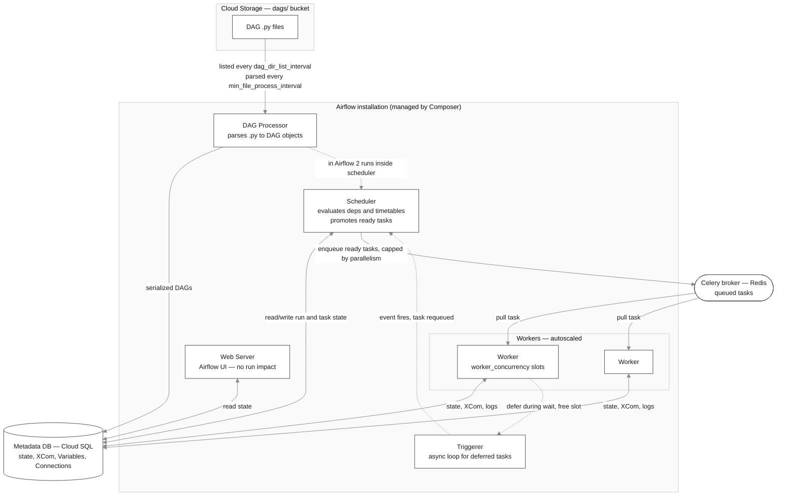
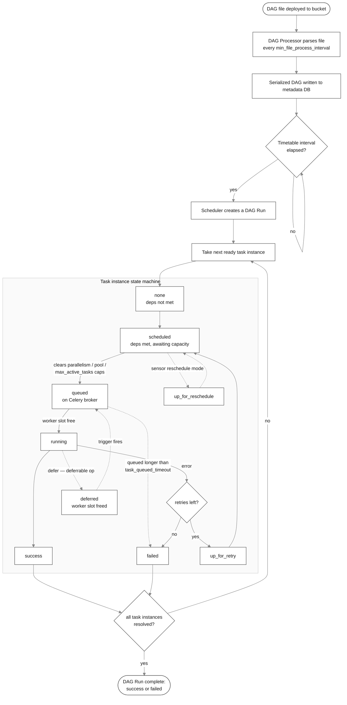
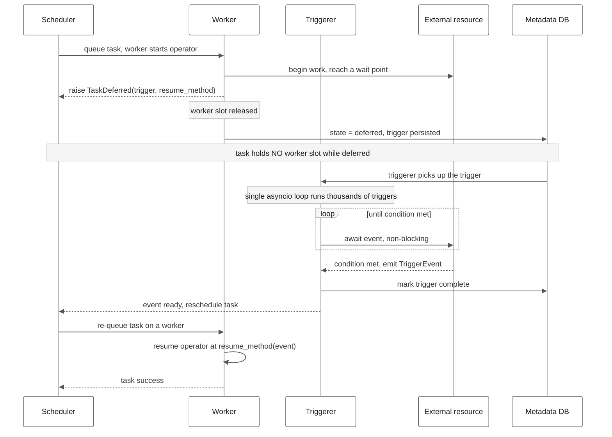

# Cloud Composer / Managed Airflow — Optimization & Troubleshooting Playbook

A practical reference for tuning and debugging Google Cloud Composer (now **Managed Service for Apache Airflow**). Two parts: **DAG optimization** (code level) and **infrastructure / server settings**. Plus diagnostics, a symptom→fix table, and a settings reference.

**Conventions**
- Every setting lists its **default**. Where Composer overrides the Apache Airflow default, both are shown.
- Targets Composer 3 / Airflow 2.x–3.x. Airflow 3 moved DAG-parsing settings from the `[scheduler]` section to `[dag_processor]`; section names are flagged where this matters.
- Composer settings are changed via **Airflow config overrides** (`gcloud composer environments update --update-airflow-configs=section-key=value`) or **environment resource updates** (CPU/memory/worker counts). The override key format is `section-key` (e.g. `core-parallelism`).

---

## 0. Foundations: the components and the task lifecycle

You can't tune what you can't locate. A Composer environment runs these Airflow components:

- **Scheduler** — decides *what* runs *when*. It reads serialized DAGs, evaluates dependencies and timetables, and pushes ready tasks into the executor's queue. It is the usual bottleneck. Composer recommends 2 schedulers; **max 3** (more degrades performance because each adds metadata-DB traffic). [[3]](https://docs.cloud.google.com/composer/docs/composer-3/optimize-environments)
- **DAG processor** — the process that *parses* your Python files into DAG objects and serializes them to the database. In Airflow 2 it runs inside the scheduler; in Airflow 3 it is a standalone component. This is the thing that runs your top-level code repeatedly.
- **Workers** — execute task code. With the **CeleryExecutor** (Composer default), workers pull tasks off a Celery queue. Composer autoscales worker count between a min and max.
- **Celery** — a distributed task queue. Airflow places ready tasks on a broker (Redis) and workers consume them. "Queued" tasks are sitting in this broker waiting for a free worker slot.
- **Triggerer** — an async event loop that runs lightweight "triggers" for deferred tasks (see §1.4). Lets idle waits happen without occupying a worker.
- **Metadata database** — Cloud SQL (Postgres) holding all task/DAG run state, XComs, Variables, Connections. Overloading it (often via bad DAG code) degrades everything.
- **Web server** — the Airflow UI. Its load does *not* affect DAG execution.

### Component / server-role relationship

Solid arrows = synchronous data/control flow; dotted arrows = asynchronous or version-dependent paths. Notice every component except the web server ultimately revolves around the metadata DB and the Celery broker — which is why those two are the most common global bottlenecks.



**Task instance states** (the path you want is `none → scheduled → queued → running → success`):

| State | Meaning |
|---|---|
| `none` | Dependencies not yet met. |
| `scheduled` | Deps met; scheduler intends to run it. **Held here by concurrency caps** (parallelism, pool, DAG limits). |
| `queued` | Handed to the executor; sitting on the Celery broker awaiting a worker. **Exposed to `task_queued_timeout`.** |
| `running` | Executing on a worker. |
| `deferred` | Suspended to a trigger; **not** holding a worker slot. |
| `up_for_reschedule` | A sensor in `reschedule` mode, sleeping between checks. |
| `up_for_retry` | Failed, retries remaining, will re-run. |

The `scheduled` vs `queued` distinction is the single most useful diagnostic lens: **stuck in `scheduled` = Airflow is throttling on purpose (a cap); stuck in `queued` = no worker can pick it up (capacity/broker).**

### DAG lifecycle — from deployment to a finished run

The top of the diagram is the macro flow (deploy → parse → DAG run created); the boxed region is the per-task-instance state machine. The dotted edges are the alternate paths (defer, reschedule, retry, queue timeout) that the §3–§4 diagnostics map onto.



---

# PART 1 — DAG Optimization (code level)

The Composer team's framing: Composer is the engine, your DAGs are the fuel. Most "Composer performance" problems are DAG code problems.

## 1.1 Top-level code & DAG parsing

**Fundamental:** Everything at module level (outside a task function) executes on *every parse*, and the DAG processor re-parses each file every `min_file_process_interval` (**default 30s**) [[9]](https://airflow.apache.org/docs/apache-airflow/stable/configuration-ref.html)[[3]](https://docs.cloud.google.com/composer/docs/composer-3/optimize-environments). So a top-level API call or `Variable.get()` runs continuously, per file, forever — consuming scheduler CPU and hammering the metadata DB. [[8]](https://airflow.apache.org/docs/apache-airflow/stable/best-practices.html)

Avoid at module level:
- `Variable.get()` / `Connection.get()` → use Jinja templating instead: `"{{ var.value.my_key }}"`, `"{{ conn.my_conn.host }}"` (resolved at run time, not parse time).
- `datetime.now()` / `datetime.today()` → recomputed every parse and breaks idempotency. Use `{{ ds }}`, `{{ data_interval_start }}`.
- Expensive imports, I/O, DB/API calls → move them *inside* task functions.

Rules: one DAG per file (each file is parsed by a single processor; a giant multi-DAG file serializes parsing); filename matches `dag_id`; keep the file a *definition*, push logic into imported modules.

## 1.2 Idempotency & atomicity

**Idempotent:** re-running the same logical date produces the same end state. Required because retries and manual clears re-execute tasks. Use upsert / `MERGE` / partition-overwrite / `DELETE WHERE ds='{{ ds }}'`-then-load — never blind `INSERT`/append (duplicates rows on every retry). [[8]](https://airflow.apache.org/docs/apache-airflow/stable/best-practices.html)

**Atomic:** a task is all-or-nothing. Write to a temp location and publish/rename at the end so a mid-task failure leaves no partial output. [[8]](https://airflow.apache.org/docs/apache-airflow/stable/best-practices.html) One task = one unit of work that can be safely re-run on its own.

## 1.3 XCom & data passing

**Fundamental:** XCom ("cross-communication") passes small values between tasks **through the metadata database**. [[8]](https://airflow.apache.org/docs/apache-airflow/stable/best-practices.html) It is not a data channel. Pass *references* (a GCS URI, a table name, an ID), not payloads. Large XComs bloat the DB, slow the scheduler, and (Airflow 3) workers no longer access the DB directly. For larger handoffs, configure a **GCS XCom backend**. Never load large DataFrames into a worker — push compute to BigQuery/Dataproc/Spark and have the task submit and poll.

## 1.4 Deferrable operators & sensors (big concurrency lever)

**The problem:** A standard operator or sensor occupies a **full worker slot for its entire runtime, even while idle**. 100 sensors waiting on files = 100 slots burned doing nothing, even though the cluster is effectively idle.

**Deferrable operators** solve this. A deferrable operator suspends itself when it has to wait, **frees the worker slot**, and hands a small async **trigger** to the **triggerer** component. The trigger runs in a shared async event loop (thousands co-exist cheaply); when the awaited event fires, the task is requeued onto a worker to finish.

**How deferral works under the hood:**

1. **Defer.** When the operator reaches a wait point, it raises a special `TaskDeferred` exception carrying two things: a **Trigger** (a small `async` object describing the event to wait for) and a `method_name` to resume at when that event fires. Raising it means "pause me, wake me there later."
2. **Release.** The worker immediately stops executing and **releases its slot**; the task instance moves to state `deferred`, and the trigger is persisted to the metadata DB. From here the task occupies *no* worker slot and (by default) *no* pool slot.
3. **Await.** The **triggerer** — a standalone process running an `asyncio` event loop — picks up the trigger and runs it. Because triggers are `async` (they `await` on I/O and yield while idle), **one triggerer process runs thousands of triggers concurrently**. [[7]](https://docs.cloud.google.com/composer/docs/composer-3/use-deferrable-operators) That is the whole efficiency win: thousands of idle waits share one lightweight process instead of consuming one worker slot each.
4. **Fire.** When the condition is met, the trigger emits a `TriggerEvent`. The triggerer marks it complete and the scheduler **re-queues** the task.
5. **Resume.** A worker picks the task back up and resumes the operator at `method_name`, receiving the event payload, and runs to completion.

Net effect: a worker is occupied only during the brief *active* phases (initial submit + resume), never during the (possibly hours-long) wait.



**Operational caveats:**
- Needs operator support: `deferrable=True` on capable operators/sensors, or a provider `*Async` operator. You cannot make an arbitrary operator deferrable without code that implements the trigger.
- The triggerer is itself a capacity unit. If it is overloaded — too many triggers, or *blocking* calls smuggled into supposedly-async trigger code — deferred tasks wake late. Keep trigger code truly non-blocking; Composer runs a triggerer, so monitor it (see Troubleshooting Airflow triggerer issues).
- Resume re-queues the task, so waking adds a small scheduling latency; it is not instantaneous.
- **Pool accounting is a sharp edge.** Whether deferred tasks count against pool slots is governed by the pool's `include_deferred` flag. In the case study below, tasks stayed *permanently stuck in `queued`* until `include_deferred=True` was set on `default_pool` (with ample slots). Verify this flag matches your intent and size the pool for your concurrency. [[13]](https://github.com/mchoirul/datamaster/blob/main/airflow-composer/COMPOSER_DEFERRABLE_PLAYBOOK.md)[[14]](https://airflow.apache.org/docs/apache-airflow/stable/authoring-and-scheduling/deferring.html)
- **`execution_timeout` counts the *whole* runtime, including the deferred phase.** It is the wall time from task start to finish, not just the active worker seconds — so it must cover the full external job duration plus polling, or deferred tasks die mid-wait. [[14]](https://airflow.apache.org/docs/apache-airflow/stable/authoring-and-scheduling/deferring.html)
- **Never `time.sleep()` in `execute_complete()` (the resume callback).** It blocks the worker callback slot and stalls the queue — defeating the point of deferral. [[13]](https://github.com/mchoirul/datamaster/blob/main/airflow-composer/COMPOSER_DEFERRABLE_PLAYBOOK.md)

**Performance impact:**
- Frees worker slots during waits → higher *effective* concurrency without adding workers, and fewer pod evictions.
- Ideal for long external waits: file/partition sensors, job-completion polling, time waits.
- Cost: requires deferrable-capable operators (`deferrable=True` or a `*Async` operator) and a running triggerer (Composer provides one). Deferred tasks **do not consume pool slots by default**.

**Sensor mode decision (rule of thumb):**

| Situation | Use |
|---|---|
| Checking every < 60s (`poke_interval` < 60) | `mode="poke"` (default) — holds a slot, but cheap for short waits |
| Checking every ≥ 60s | `mode="reschedule"` — frees the slot between checks (state `up_for_reschedule`) |
| Long / event-based waits, want max efficiency | `deferrable=True` — offloads to the triggerer, frees the slot entirely |

`mode="reschedule"` only supports *time*-based re-checks; `deferrable=True` can resume on arbitrary events but needs operator support. [[7]](https://docs.cloud.google.com/composer/docs/composer-3/use-deferrable-operators)

## 1.5 Other code-level wins

- **TaskFlow API** (`@dag`/`@task`) — implicit XCom passing, less boilerplate.
- **Dynamic task mapping** (`.expand()`) for fan-out, instead of generating many near-identical DAGs.
- **Assets/Datasets** for data-aware scheduling instead of cross-DAG sensor chains.
- **Spread the load:** stagger schedules; consolidate many tiny tasks into fewer larger ones (tiny tasks have high per-task scheduling overhead and can cause overeager autoscaling — see §2.3).

## 1.6 Anti-patterns to avoid (code level) [[8]](https://airflow.apache.org/docs/apache-airflow/stable/best-practices.html)[[11]](https://www.astronomer.io/docs/learn/dag-best-practices)

| Anti-pattern | Why it hurts | Do instead |
|---|---|---|
| Work in top-level code (`Variable.get`, API/DB calls, heavy imports) | Runs every 30s per file; spikes scheduler CPU & DB load | Jinja templates; move into tasks; cheap top level |
| `datetime.now()` at module level | Breaks idempotency; recomputed every parse | `{{ ds }}`, `{{ data_interval_start }}` |
| Non-idempotent writes (blind INSERT) | Retries/clears duplicate data | Upsert / MERGE / partition overwrite |
| Non-atomic tasks | Partial output on failure; unsafe to re-run | Temp + atomic publish |
| Large data via XCom | Bloats metadata DB; slows scheduler | Pass references; GCS XCom backend |
| Processing big data in a PythonOperator | Worker OOM → pod eviction → task failure | Push to BigQuery/Dataproc/Spark |
| Poke-mode sensors for long waits | Burns worker slots while idle | `reschedule` or `deferrable=True` |
| Many DAGs per file | Serialized parsing; slow UI updates | One DAG per file |
| Dynamic start_date / mutable defaults | Erratic or never-firing scheduling | Static `start_date` |
| SubDAGs (removed in Airflow 3) [[12]](https://airflow.apache.org/docs/apache-airflow/stable/release_notes.html) | Deadlocks, removed entirely | TaskGroups |
| Secrets in code / plaintext Variables | Security; DB reads | Connections + Secret Manager backend |
| Many top-level globals / Variables | Heavy DB use → DB health failures | Minimize; template; cache in tasks |

---

# PART 2 — Infrastructure / Server Setting Optimization

## 2.1 The concurrency model: parallelism ↔ worker_concurrency ↔ pool slots

These three operate at different layers; **the lowest applicable limit wins**, and they interact.

**`[core]parallelism`** — max task instances **running or queued across the whole Airflow installation, per scheduler**. **Default 32**; `0` = infinite. [[9]](https://airflow.apache.org/docs/apache-airflow/stable/configuration-ref.html) It's a global backpressure valve. When hit, the scheduler stops promoting tasks; they stay in `scheduled` (safe, no failure). On Composer 2 it is effectively bounded by worker capacity (≈ `max_workers × worker_concurrency`). **Composer 3 correction (from the case study below):** Composer 3 manages parallelism dynamically — its effective default behaves like `0` (auto, scaling with the cluster), so an explicit finite override can be *more restrictive than the default* and throttle you below real capacity. On Composer 3, **remove the `core-parallelism` override** unless you deliberately want a hard cap. [[13]](https://github.com/mchoirul/datamaster/blob/main/airflow-composer/COMPOSER_DEFERRABLE_PLAYBOOK.md)[[15]](https://cloud.google.com/composer/docs/composer-3/environment-scaling)

**`[celery]worker_concurrency`** — how many tasks **a single worker** pulls from the queue at once. Composer default (Airflow ≥ 2.3.3) = **`min(32, 12 × worker_CPU, 8 × worker_memory_GB)`**. [[1]](https://cloud.google.com/blog/products/data-analytics/airflow-dag-and-task-concurrency-in-cloud-composer/)[[3]](https://docs.cloud.google.com/composer/docs/composer-3/optimize-environments) Examples: 0.5 CPU/2GB → 6; 2 CPU/7.5GB → 24; 4 CPU/15GB → 32. This is the actual *execution* capacity per worker.

**Pool slots** — a **pool** caps concurrency for an arbitrary *set* of tasks (e.g. "max 5 hits to a fragile API"). Assign a task `pool="my_pool"`; the pool has N slots. The catch-all `default_pool` has **128 slots** by default. [[9]](https://airflow.apache.org/docs/apache-airflow/stable/configuration-ref.html) Deferred tasks don't occupy pool slots unless you configure the pool to count them.

**How they relate:**
- A task runs only if it clears **all** of: `parallelism` (global), `max_active_tasks_per_dag` (its DAG), `max_active_runs_per_dag` (its DAG's runs), its **pool** slots, and there is a free **worker slot** (`worker_concurrency × active_workers`).
- **Total real execution capacity ≈ `active_workers × worker_concurrency`**, bounded above by `parallelism`. If `parallelism` < worker capacity, you waste workers. If `parallelism` > worker capacity, the scheduler queues more than workers can take → tasks pile in `queued` → risk `task_queued_timeout` failures. [[5]](https://docs.cloud.google.com/composer/docs/composer-3/debug-task-scheduling-issues)
- **worker_concurrency's hidden role:** it's the denominator of the autoscaler (§2.3). It controls not just per-worker load but whether new workers ever spawn.

**Tuning intent:**
- One DAG runs too few tasks at once → raise `max_active_tasks_per_dag` / DAG-level `max_active_tasks`.
- Same DAG can't run enough concurrent runs → raise `max_active_runs_per_dag` / DAG-level `max_active_runs`.
- Whole environment capped → raise `parallelism` **and** ensure worker capacity exists.

### When a DAG demands more concurrency than the cluster can run

This is the most common concurrency misunderstanding, so it's worth spelling out. **`max_active_tasks` is a permission ceiling, not a capacity reservation.** Setting a DAG's `max_active_tasks=50` says "this DAG is *allowed* to have up to 50 tasks running at once" — it does **not** create slots to run them. Physical capacity is still `active_workers × worker_concurrency`, capped globally by `parallelism`. So if the DAG's allowed concurrency exceeds what the cluster can execute, the extra tasks don't run faster — they wait.

> **Important scope:** everything in this subsection assumes **blocking (synchronous)** tasks that hold a worker slot for their entire runtime. **Deferrable tasks invert this math** — they hold a slot only for the ~seconds of init + callback, so "tasks ≫ slots" is normal and fine, and raising `max_active_tasks` high *is* the correct move (capacity is cheap because slots cycle in seconds). See §1.4 and the empirical Case Study (Lessons 2 and 8). [[13]](https://github.com/mchoirul/datamaster/blob/main/airflow-composer/COMPOSER_DEFERRABLE_PLAYBOOK.md)

**What actually happens, step by step:**
1. The scheduler finds 50 ready tasks and moves them to `scheduled` (the DAG's own cap permits all 50).
2. It promotes them toward `queued` up to the binding global limit. If `parallelism` is the binding cap, only that many become `queued`; the rest stay parked in `scheduled` (safe backpressure, no failure).
3. Queued tasks land on the Celery broker. Workers pull up to `worker_concurrency` each. Whatever exceeds `active_workers × worker_concurrency` **sits in `queued`** waiting for a slot to free up.
4. The autoscaler reacts to that backlog — `target_workers = ceil((running + queued) / worker_concurrency)` — and adds workers toward **max workers**.
5. **Two outcomes:**
   - **max workers is high enough** → workers scale up until capacity ≈ demand, the queue drains, all 50 eventually run (in waves, not necessarily instantly).
   - **max workers caps out below demand** → throughput plateaus at `max_workers × worker_concurrency`; the surplus tasks stay `queued`. Those queued tasks are now **exposed to `task_queued_timeout` (Composer default 2400s / 40 min)** [[5]](https://docs.cloud.google.com/composer/docs/composer-3/debug-task-scheduling-issues) — if a slot doesn't free up in time, they're marked failed and retried, even though nothing is actually broken.

**Worked example.** DAG with `max_active_tasks=50`; environment has `worker_concurrency=6`, `min_workers=1`, `max_workers=4`, `parallelism=32`.
- Hard ceiling on simultaneously *running* tasks = `4 × 6 = 24` workers slots, and `parallelism=32` is not the binding limit here (24 < 32).
- So at steady state ~24 of the 50 run; ~the rest queue; the autoscaler drives workers to 4 (`ceil(50/6)=9`, clamped to max 4). The DAG finishes in roughly ⌈50/24⌉ ≈ 3 waves.
- If `parallelism` were instead set to 12, only 12 would ever be `queued`/`running` at once regardless of workers — `parallelism` would be the bottleneck and ~38 tasks would sit in `scheduled`.

**The three things this teaches:**
- **Raising a DAG's `max_active_tasks` without adding capacity changes nothing** except moving tasks from "blocked by DAG cap" to "queued waiting for a worker." To genuinely run more at once you must raise `max_workers` and/or `worker_concurrency`, and confirm `parallelism` is ≥ the target.
- **Watch the queue-timeout trap.** Demanding far more concurrency than `max_workers × worker_concurrency` can deliver doesn't just slow things down — it can fail tasks via `task_queued_timeout`. Either raise capacity or lower the DAG's ambition.
- **One greedy DAG starves the others.** Because all DAGs share the same worker pool, a DAG fanning out 50 tasks can monopolize every slot and stall unrelated DAGs. Use a **pool** (a named set of slots a group of tasks must acquire) to fence a DAG's share, or cap it with `max_active_tasks`, so it can't consume the whole cluster.

A subtle capacity caveat: you can "match" a DAG's appetite by cranking `worker_concurrency` high, but each concurrent task on a worker shares that worker's memory — too many at once causes OOM and pod eviction (every task on the evicted worker fails). And very high `worker_concurrency` also suppresses autoscaling (see §2.3). Prefer *more workers* over *more tasks per worker* when scaling out wide fan-outs.

## 2.2 Worker sizing

- Raise **max workers** when the environment frequently sits at max workers *and* the Celery queue is persistently high. [[10]](https://www.astronomer.io/docs/learn/airflow-scaling-workers)[[1]](https://cloud.google.com/blog/products/data-analytics/airflow-dag-and-task-concurrency-in-cloud-composer/)
- Raise **worker memory** when you see pod evictions / worker restarts (OOM is the usual cause — see §3).
- Raise **worker CPU** (or lower `worker_concurrency`) when worker CPU is pegged > 80% and individual tasks are CPU-heavy.
- **Pod eviction:** GKE kills a pod that exceeds its resource limits; every task on an evicted worker is interrupted and marked failed. Almost always worker OOM. Mitigate with more worker memory or lower `worker_concurrency` (fewer concurrent tasks per worker = more memory each).

## 2.3 Why the autoscaler doesn't kick in (worker_concurrency relationship)

**Composer scales worker count on the Celery queue:** `target_workers = ceil((running_tasks + queued_tasks) / worker_concurrency)` [[1]](https://cloud.google.com/blog/products/data-analytics/airflow-dag-and-task-concurrency-in-cloud-composer/).

**Failure mode A — concurrency too high, queue never fills:** If `worker_concurrency` is large, each worker grabs many tasks, draining the queue. The autoscaler sees a near-empty queue → low target → **never adds workers**, even while existing workers are saturated and tasks run slowly. *Example:* 2 workers, `worker_concurrency=100`, 200 queued → each takes 100, queue empties, no scale-up; long tasks then bottleneck. **Fix:** lower `worker_concurrency` so the queue retains a backlog, and raise `max_workers` to keep total capacity (e.g. halve concurrency, double max workers).

**Failure mode B — Airflow throttles tasks *before* the queue:** Composer can only scale on what reaches the queue. If `parallelism`, `max_active_tasks_per_dag`, or `max_active_runs_per_dag` is holding tasks in `scheduled`, the queue stays short and the autoscaler stays idle — you see high inter-task latency but no scale-up. **Fix:** raise the binding Airflow cap so tasks flow into the queue; *then* the autoscaler responds.

**Over-eager scaling (the inverse):** With many *small, fast* tasks and high `worker_concurrency`, a queue spike spawns workers that have nothing to do by the time they're ready. **Fix:** raise **min workers** instead of relying on burst scaling.

Diagnostic signature: **high task latency + workers below max + non-empty `scheduled` count = config throttle (B); high latency + empty queue + workers below max = concurrency-too-high (A).**

## 2.4 Scheduler & DAG processor tuning

Watch scheduler CPU:
- Consistently **< 30–35%** → over-provisioned; reduce scheduler count or CPU to save cost.
- **> 80%** for more than a small fraction of time → overloaded [[3]](https://docs.cloud.google.com/composer/docs/composer-3/optimize-environments); do one or more of: increase parse intervals (below), add a scheduler (to 2), or add scheduler CPU.

Parsing levers:
- **`min_file_process_interval`** (`[scheduler]`; `[dag_processor]` in Airflow 3) — re-parse frequency. **Default 30s.** Raise (e.g. 60–120s) when you have many DAGs that change infrequently or scheduler CPU is high. Trade-off: edits appear more slowly. **Composer caps its effect** — it can't exceed the time for the scheduler to complete `num_runs` loops, and the scheduler restarts every `[scheduler]num_runs` loops (**Composer default 5000**) [[3]](https://docs.cloud.google.com/composer/docs/composer-3/optimize-environments) as auto-healing.
- **`dag_dir_list_interval`** (`[scheduler]`) — how often the bucket is scanned for *new/deleted* files. **Composer default 120s** (Apache core historically 300s). [[3]](https://docs.cloud.google.com/composer/docs/composer-3/optimize-environments) Raise it if you deploy DAGs infrequently.
- **`parsing_processes`** — parallel parse workers (Apache default 2). Raise for many files.

## 2.5 Database

The metadata DB (Cloud SQL) is sized by **environment size** (Small/Medium/Large), not directly tunable. If DB CPU/memory > 80% sustained, either reduce load (fewer top-level Variables/connections, more efficient DAGs, spread load) or **increase environment size**. DB disk auto-extends, so disk isn't usually a concern. Periodically **clean up the Airflow database** (old task/run history) to keep it fast.

## 2.6 Environment presets (starting points)

| Preset | Total DAGs | Max concurrent DAG runs | Max concurrent tasks |
|---|---|---|---|
| Small | 50 | 15 | 18 |
| Medium | 250 | 60 | 100 |
| Large | 1000 | 250 | 400 |

Optimize iteratively: start from a preset → run real workloads → observe metrics → adjust → repeat. [[3]](https://docs.cloud.google.com/composer/docs/composer-3/optimize-environments)

## 2.7 Settings reference (with defaults) [[9]](https://airflow.apache.org/docs/apache-airflow/stable/configuration-ref.html)[[3]](https://docs.cloud.google.com/composer/docs/composer-3/optimize-environments)

| Setting | Section | Default | Notes |
|---|---|---|---|
| `parallelism` | `core` | **32** (Apache core) — **Composer 3: dynamic/auto (`0`-like)** | Global running+queued cap per scheduler; `0`=infinite. On Composer 3 leave it unset; a finite override can throttle below auto capacity (see Case Study, Lesson 7) |
| `max_active_tasks_per_dag` | `core` | **16** | Per-DAG concurrent tasks (formerly `dag_concurrency`) |
| `max_active_runs_per_dag` | `core` | **16** (Composer optimize doc cites **25** — verify with `airflow config get-value`) | Per-DAG concurrent runs |
| `worker_concurrency` | `celery` | **`min(32, 12×CPU, 8×mem_GB)`** | Tasks per worker; autoscaler denominator |
| `min_file_process_interval` | `scheduler` / `dag_processor` (A3) | **30s** | Re-parse frequency; raise to cut scheduler CPU |
| `dag_dir_list_interval` | `scheduler` | **120s** (Composer) | New-file scan frequency |
| `task_queued_timeout` | `scheduler` | **2400s** (Composer) / 600s (Apache) | Max time in `queued` before fail/reschedule |
| `num_runs` | `scheduler` | **5000** (Composer) | Scheduler restarts after this many loops |
| `parsing_processes` | `scheduler` | 2 | Parallel parse processes |
| `default_pool` slots | (pool) | **128** | Catch-all pool for untagged tasks |
| Scheduler count | (env) | 1 (recommend **2**, **max 3**) | More adds DB traffic |

Override example:
```bash
gcloud composer environments update YOUR_ENV --location YOUR_REGION \
  --update-airflow-configs=core-parallelism=96,celery-worker_concurrency=12,scheduler-min_file_process_interval=60
```
Resource example (restarts components — do when no critical DAGs run):
```bash
gcloud composer environments update YOUR_ENV --location YOUR_REGION \
  --worker-memory=4 --worker-cpu=2 --max-workers=8 --scheduler-count=2
```

---

# PART 3 — Diagnostics: what to look at

Use the environment's **Monitoring** dashboard (Environment details → Monitoring). Investigate in this order; the first sections catch the most common problems.

**Health/red-flag metrics (set alerts):** [[4]](https://docs.cloud.google.com/composer/docs/composer-3/monitor-key-metrics)

| Metric | Healthy benchmark | If breached |
|---|---|---|
| Environment health (`airflow_monitoring` liveness DAG) | ≥ 90% success / 4h | Pod evictions or overload; check component metrics below |
| Database health | ≥ 95% success / 4h | DB connectivity/overload — often from bad DAG code (globals/Variables) |
| Database CPU / memory | < 80% mean / 12h | Overloaded → efficient DAGs or larger environment size |
| Scheduler heartbeat | ≥ 90% (≈ count ≥ 216 / 4h; idle ≈ 240) | Unhealthy if last beat > 30s; add scheduler resources or a 2nd scheduler |
| Zombie tasks killed | ≤ 1 / 24h | Worker CPU/memory shortage; raise worker resources |
| Worker container restarts | ≤ 1 / 24h | Worker OOM/storage; raise worker memory/storage |

> **Zombie task:** a task whose worker process died (eviction, OOM, node kill) without reporting back; the scheduler detects the missing heartbeat and marks it failed.

**Performance metrics (capacity tuning):** [[3]](https://docs.cloud.google.com/composer/docs/composer-3/optimize-environments)[[4]](https://docs.cloud.google.com/composer/docs/composer-3/monitor-key-metrics)

| Metric | What it tells you | Action if bad |
|---|---|---|
| **Total DAG parse time** | > ~10s means parse cycles overlap (default interval 30s) and exhaust scheduler | Simplify DAGs; raise parse intervals; add scheduler CPU |
| **Scheduler CPU/memory** | < 30–35% over-provisioned; > 80% overloaded | Scale schedulers down / up accordingly |
| **Active workers vs Airflow tasks (queued)** | At max workers + high queue = need workers; high latency + below max = throttle | See §2.3 |
| **Worker CPU/memory** | Memory near limit → evictions imminent | More worker memory or lower `worker_concurrency` |
| **Worker pod evictions** | OOM interrupting tasks | More worker memory; lower concurrency |
| **Task scheduling latency** (Airflow UI) | > ~20s between tasks = environment can't keep up | Scheduler overloaded, config throttle, or too few workers |
| **Web server CPU/memory** | UI slowness only; no DAG-run impact | Add web server resources if needed |

**CLI helpers:**
```bash
# Per-file parse durations (find the slow DAGs)
gcloud composer environments run YOUR_ENV --location YOUR_REGION dags report

# Confirm an effective config value
gcloud composer environments run YOUR_ENV --location YOUR_REGION config get-value -- core parallelism
```

---

# PART 4 — Common symptoms → cause → fix

| Symptom | Likely cause | Fix |
|---|---|---|
| Tasks stuck in **scheduled** | A concurrency cap is binding (parallelism / max_active_tasks / max_active_runs / pool) — this is safe backpressure | Raise the binding cap; confirm `parallelism` ≠ 0-misconfig |
| Tasks stuck in **queued**, never run | Worker capacity < what's queued, or broker (Redis) unhealthy | Add workers / raise `worker_concurrency`; check `celery inspect ping`; watch `task_queued_timeout` |
| Tasks fail after sitting **queued** ~40 min | `task_queued_timeout` (2400s) tripped because no worker picked them up | Align `parallelism` to worker capacity; add workers |
| High inter-task latency, **workers below max** | Autoscaler not triggering: `worker_concurrency` too high, or Airflow throttling before the queue | Lower `worker_concurrency` + raise max workers; or raise the binding DAG/parallelism cap (§2.3) |
| Autoscaler spawns workers that idle | Over-eager scaling on many small/fast tasks | Raise **min** workers; don't rely on burst scaling |
| Zombie tasks / worker restarts / pod evictions | Worker OOM (often big data in a PythonOperator) | Push compute out; raise worker memory; lower `worker_concurrency` |
| DAG edits slow to appear in UI | `min_file_process_interval` / `dag_dir_list_interval` too high, or parse time high | Lower intervals (costs CPU) or simplify DAGs |
| Database health red / DB CPU high | Top-level code, many globally-defined Variables, large XComs, too many connections | Fix DAG code (§1); clean up DB; increase env size |
| Scheduler heartbeat red | Scheduler overloaded by parsing or DB latency | Raise parse intervals; add scheduler CPU; go to 2 schedulers |
| Single DAG slow despite spare capacity | Its `max_active_tasks` / `max_active_runs` too low | Raise DAG-level limits |
| Sensors consuming all slots | Poke-mode sensors idling in worker slots | `mode=reschedule` (≥60s) or `deferrable=True` |

---

# PART 5 — Case study: scaling 140 deferrable tasks on Composer 3

A published empirical playbook [[13]](https://github.com/mchoirul/datamaster/blob/main/airflow-composer/COMPOSER_DEFERRABLE_PLAYBOOK.md) stress-tested a deferrable-heavy workload on real Composer 3 (us-central1, Medium preset) across **8 iterative runs**. Workload: **2 DAGs × 70 tasks = 140 concurrent deferrable tasks** (`AirbyteTriggerSyncOperator`, `deferrable=True`, polling a mock service for ~120s each). It's the best public ground-truth check on the theory in this playbook. The findings below are mapped to the sections they confirm, sharpen, or correct.

### What it confirms

- **Two schedulers beat one — even at equal total vCPU** (§0, §2.4). `1×1vCPU` scheduler → up to 16 task failures; `2×0.5vCPU` → 0 failures, repeatedly. The added insight: deferrable tasks cause *intense metadata-DB activity* (each cycles `queued→scheduled→deferred→queued→scheduled→running`), and a single scheduler serializes on DB row locks. So "use 2 schedulers" is not just throughput — for deferrable-heavy loads it's a *correctness/reliability* lever. [[13]](https://github.com/mchoirul/datamaster/blob/main/airflow-composer/COMPOSER_DEFERRABLE_PLAYBOOK.md)
- **Explicit `worker_concurrency` beats auto — the autoscaler trap is real** (§2.3). Auto (~12) gave failures; explicit (8 or 16) gave none. Mechanism is exactly §2.3 Failure Mode A: high/auto concurrency lets workers swallow the whole queue instantly → autoscaler sees an empty queue → never scales → the synchronized callback burst 120s later has too few workers → timeouts. Lower explicit concurrency keeps a healthy queue backlog so the autoscaler provisions *ahead* of the burst. [[13]](https://github.com/mchoirul/datamaster/blob/main/airflow-composer/COMPOSER_DEFERRABLE_PLAYBOOK.md)
- **A single small triggerer scales far** (§1.4). One `0.5 vCPU / 1 GB` triggerer handled all 140 concurrent async polls with zero issues — consistent with Airflow's "hundreds to tens of thousands of triggers per host." Start with one minimal triggerer; add a second only for HA. [[14]](https://airflow.apache.org/docs/apache-airflow/stable/authoring-and-scheduling/deferring.html)
- **Web server spec affects tooling, not DAG runs** (§0, §2.4). A `0.5 vCPU` web server timed out `gcloud composer environments run` (3–10 min) while DAGs ran fine. Practical consequence for this playbook: the gcloud CLI examples assume a responsive web server — keep it at ~1 vCPU if you rely on CLI, or use the **Airflow REST API** instead. [[13]](https://github.com/mchoirul/datamaster/blob/main/airflow-composer/COMPOSER_DEFERRABLE_PLAYBOOK.md)
- **`max_active_tasks_per_dag` default 16 is a hard cap** (§2.1, §2.7). With 70 tasks/DAG they raised it to 80. Confirms the default and the "raise it to your peak per-DAG concurrency" guidance.

### What it sharpens (deferrable changes the model)

- **The capacity math inverts for deferrable** (§2.1 "When a DAG demands more concurrency…"). That subsection's wave model assumes *blocking* tasks holding a slot for their whole runtime. Here, `1 vCPU × 8 conc × 6 nodes = 48 slots` successfully ran **140 tasks (~3× oversubscribed)** — because a deferrable task occupies a slot only ~1–3s (init + callback), so 48 slots cycle through 140 tasks in well under a minute, and the ~117s wait lives in the triggerer. **For deferrable workloads, "tasks ≫ worker slots" is expected, not a problem.** [[13]](https://github.com/mchoirul/datamaster/blob/main/airflow-composer/COMPOSER_DEFERRABLE_PLAYBOOK.md)[[14]](https://airflow.apache.org/docs/apache-airflow/stable/authoring-and-scheduling/deferring.html)
- **Concurrency tuning becomes a *memory* decision, not a throughput one** (§2.2). Throughput at `conc=8` (1 vCPU) ≈ `conc=16` (2 vCPU). The reason to pick 8 is RAM headroom: `4 GB ÷ 8 = 500 MB/task` vs `7.5 GB ÷ 24 ≈ 312 MB/task` — ~60% more memory per task during the init/callback phases, lowering OOM/eviction risk. Reinforces §2.2's "prefer more workers over more tasks per worker."
- **`default_pool.include_deferred` can silently strand tasks** (§1.4). Already folded into the §1.4 caveats: tasks stuck in `queued` until `include_deferred=True` was set with a large pool. This is the kind of pool-accounting gotcha the original §1.4 ("don't consume pool slots by default") understated.

### What it corrects

- **`core-parallelism` default on Composer 3** (§2.1, §2.7). This playbook originally carried the Apache core default of **32**. On **Composer 3 the effective default is dynamic (`0`-like, auto-scaling with the cluster)**, and the case study found that setting `parallelism=400` was *more restrictive than leaving it unset*. Corrected inline: on Composer 3, **remove the override** unless you want a deliberate hard cap. [[13]](https://github.com/mchoirul/datamaster/blob/main/airflow-composer/COMPOSER_DEFERRABLE_PLAYBOOK.md)[[15]](https://cloud.google.com/composer/docs/composer-3/environment-scaling)

### What it adds (not previously in this playbook)

- **The external service becomes the real bottleneck** (new). Deferrable removes Airflow's *natural rate limiter* — worker-slot exhaustion. Each trigger polls the downstream API independently, so 140 deferred tasks = 140 concurrent pollers that can effectively DDoS a downstream service. Runs against a single-instance mock API produced 7–16 timeout failures; scaling the API to handle the concurrency fixed it. **Mitigation: cap concurrent external calls with an Airflow Pool, set realistic operator `timeout`, and `retries=3` / `retry_delay=60s`.** This is the deferrable-specific counterpart to §1.1–§1.6 anti-patterns. [[13]](https://github.com/mchoirul/datamaster/blob/main/airflow-composer/COMPOSER_DEFERRABLE_PLAYBOOK.md)[[7]](https://docs.cloud.google.com/composer/docs/composer-3/use-deferrable-operators)

### Lesson → playbook mapping

| # | Empirical lesson | Maps to | Verdict |
|---|---|---|---|
| 1 | 2 small schedulers > 1 large (DB-lock contention) | §0, §2.4 | Confirms + sharpens |
| 2 | `worker_concurrency` barely affects deferrable throughput | §2.1, §2.2 | Sharpens (capacity model inverts) |
| 3 | Explicit concurrency beats auto (autoscaler trap) | §2.3 | Confirms |
| 4 | `default_pool.include_deferred` critical | §1.4 | Adds gotcha |
| 5 | One 0.5 vCPU triggerer handles 100s of triggers | §1.4 | Confirms |
| 6 | External API capacity is the real bottleneck | new (§1.x) | Adds |
| 7 | `core-parallelism` default is auto/unlimited on Composer 3 | §2.1, §2.7 | **Corrects** |
| 8 | `max_active_tasks_per_dag` must exceed peak per-DAG tasks | §2.1, §2.7 | Confirms |
| 9 | Web server spec affects CLI tooling, not DAG runs | §0, §2.4 | Confirms |
| 10 | `execution_timeout` counts the deferred phase | §1.4 | Adds |

### Their recommended deferrable baseline (for reference)

For hundreds of concurrent deferrable tasks, the case study landed on: schedulers `count 2 / 0.5 vCPU / 2 GB`; workers `1 vCPU / 4 GB / min 1 / max 6`; **one** triggerer `0.5 vCPU / 1 GB`; web server `1 vCPU / 2 GB`; `worker_concurrency=8` (explicit); `default_pool` with `include_deferred: True` and generous slots; `max_active_tasks_per_dag=80`; and **no `parallelism` override**. The headline result: deferrable operators let them hit Medium/Large-tier concurrency on near-Small compute — *provided the schedulers are balanced and concurrency is set explicitly*. Treat these as a starting point to validate against your own metrics (§3), not universal constants. [[13]](https://github.com/mchoirul/datamaster/blob/main/airflow-composer/COMPOSER_DEFERRABLE_PLAYBOOK.md)

---

## References

Inline markers like [3] throughout the playbook link to the matching source below.

**[1]** [Airflow DAG and task concurrency in Cloud Composer (Google Cloud blog)](https://cloud.google.com/blog/products/data-analytics/airflow-dag-and-task-concurrency-in-cloud-composer/)

**[2]** [Optimize Cloud Composer via better Airflow DAGs (Google Cloud blog)](https://cloud.google.com/blog/products/data-analytics/optimize-cloud-composer-via-better-airflow-dags)

**[3]** [Optimize environment performance and costs (Cloud Composer 3 docs)](https://docs.cloud.google.com/composer/docs/composer-3/optimize-environments)

**[4]** [Monitor environment health with key metrics (Cloud Composer 3 docs)](https://docs.cloud.google.com/composer/docs/composer-3/monitor-key-metrics)

**[5]** [Debug task scheduling issues (Cloud Composer 3 docs)](https://docs.cloud.google.com/composer/docs/composer-3/debug-task-scheduling-issues)

**[6]** [Troubleshooting Airflow scheduler issues (Cloud Composer 3 docs)](https://docs.cloud.google.com/composer/docs/composer-3/troubleshooting-scheduling)

**[7]** [Use deferrable operators (Cloud Composer 3 docs)](https://docs.cloud.google.com/composer/docs/composer-3/use-deferrable-operators)

**[8]** [Airflow Best Practices (Apache Airflow docs)](https://airflow.apache.org/docs/apache-airflow/stable/best-practices.html)

**[9]** [Airflow Configuration Reference (Apache Airflow docs)](https://airflow.apache.org/docs/apache-airflow/stable/configuration-ref.html)

**[10]** [Scaling Airflow to optimize performance (Astronomer)](https://www.astronomer.io/docs/learn/airflow-scaling-workers)

**[11]** [DAG writing best practices (Astronomer)](https://www.astronomer.io/docs/learn/dag-best-practices)

**[12]** [Airflow 3 Release Notes / deprecations (Apache Airflow docs)](https://airflow.apache.org/docs/apache-airflow/stable/release_notes.html)

**[13]** [Cloud Composer 3 Deferrable Operators Playbook — empirical case study (mchoirul/datamaster)](https://github.com/mchoirul/datamaster/blob/main/airflow-composer/COMPOSER_DEFERRABLE_PLAYBOOK.md)

**[14]** [Apache Airflow — Deferrable Operators & Triggers (Deferring)](https://airflow.apache.org/docs/apache-airflow/stable/authoring-and-scheduling/deferring.html)

**[15]** [Google Cloud — About environment scaling (Composer)](https://cloud.google.com/composer/docs/composer-3/environment-scaling)

> Note: some Composer docs are version-tagged (Composer 2/3) and a few defaults differ between Composer and core Airflow (flagged above). Always confirm a live value with `config get-value` before relying on it.
